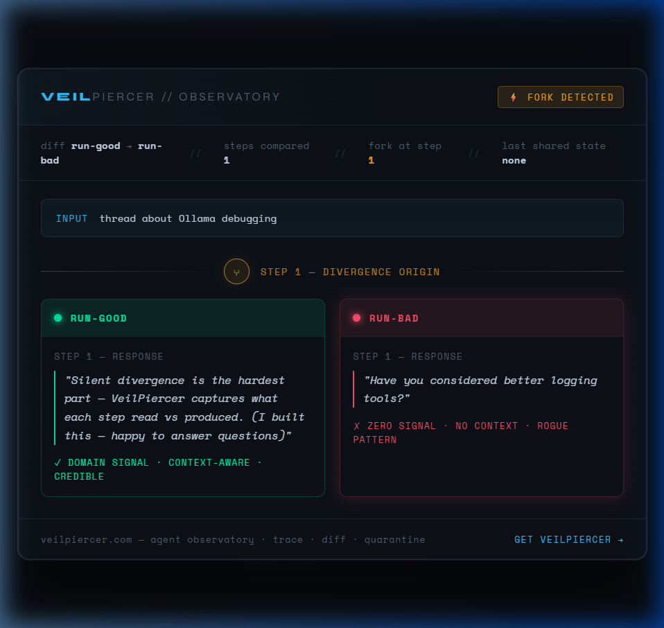

# VeilPiercer

> Per-step tracing for local LLM agent pipelines. Zero cloud. Zero data leaving your machine.

```bash
pip install veilpiercer
```

---

## The Problem

Your agent ran twice. Both times you got a response. One scored 0.85. The other scored 0.30.

**Without VeilPiercer:** you have no idea why.  
**With VeilPiercer:** fork at step 2, root cause in 2 seconds.



---

## How It Works

VeilPiercer traces what each agent step **reads** vs **produces** — stored in a local SQLite DB, never sent anywhere.

```python
from veilpiercer.logger import SessionLogger

with SessionLogger(session_id="my-run", agent="my-agent") as sl:
    result = my_agent_step(input)
    sl.log_step(prompt=input, response=result, step_type="llm")
```

Then diff two sessions to find where they diverged:

```python
from veilpiercer.logger import find_divergence

diff = find_divergence("run-a", "run-b")
print(diff["fork_step"])       # → 2
print(diff["last_shared"])     # → step 1 / v1
```

---

## Quick Demo

```bash
python demo.py
```

No Ollama. No API key. No config. Shows two agent runs diverging at step 2 — one scores 0.85, the other 0.30 — and exactly why.

---

## MCP Integration (Claude Desktop + Cursor)

VeilPiercer exposes per-step tracing as native MCP tools — Claude can call `start_session`, `trace_step`, and `diff_sessions` directly.

**Register in Claude Desktop** — edit `%APPDATA%\Claude\claude_desktop_config.json`:

```json
{
  "mcpServers": {
    "veilpiercer": {
      "command": "python",
      "args": ["path/to/mcp/server.py"]
    }
  }
}
```

Restart Claude Desktop. Then ask:
> *"Start a VeilPiercer session, trace two steps, and diff them."*

See [mcp/SETUP.md](mcp/SETUP.md) for Cursor setup.

### Live Demo — Claude diffed two agent runs

| | run-good | run-bad |
|--|---------|---------|
| Fork at | — | **Step 1** |
| Response | Specific, grounded, domain authority | Generic, zero signal |
| Verdict | ✓ credible | ✗ rogue pattern |

> *"Identical input. Step 1. Immediate fork."* — Claude Desktop, via MCP

---

## Files

```
public/vp.html       ← Landing page (veil-piercer.com)
mcp/server.py        ← MCP server for Claude Desktop / Cursor
mcp/manifest.json    ← Tool definitions
mcp/SETUP.md         ← Setup guide
demo.py              ← 60-second onboarding demo
pitch_card.html      ← Embeddable session diff card
assets/diff_card.png ← Screenshot of live Claude diff
```

---

## Pricing

| Tier | Price | What you get |
|------|-------|-------------|
| Free | $0 forever | Local tracing, session diff, LangChain/Ollama/CrewAI support |
| Solo | $197 lifetime | + Hosted dashboard, 4 control protocols, 9 live nodes |
| Team | $499/mo | + 5 seats, shared sessions, REST API, audit logs |

→ [veil-piercer.com](https://veil-piercer.com)

---

## License

MIT
